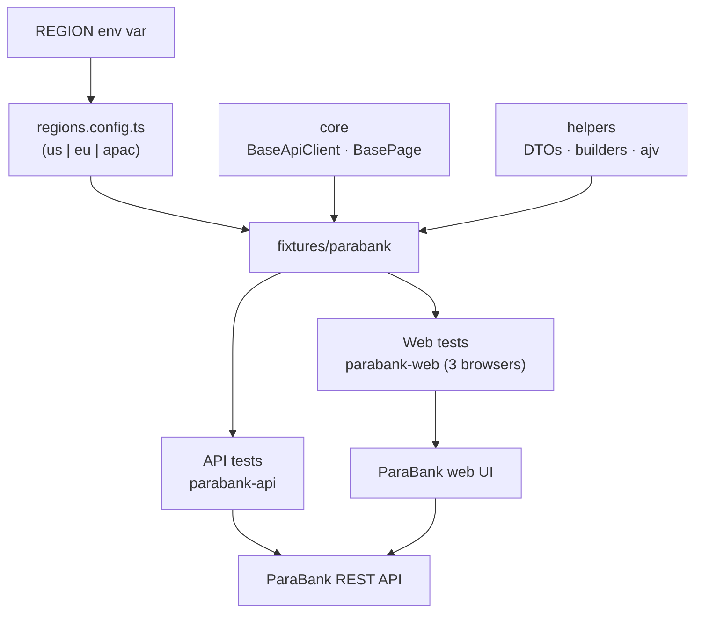

# ParaBank QA Framework - Multi-Region Playwright

[](https://github.com/stalevski/parabank-qa-framework/actions/workflows/playwright.yml)
[](https://playwright.dev/)
[](https://www.typescriptlang.org/)
[](.nvmrc)

A Playwright + TypeScript test framework for a financial-services context, built
against ParaBank, Parasoft's demo banking app (web UI + REST API). The API and
Web layers run on their own but share the same plumbing, and adding a new region
is a config change rather than a code change.

---

## Quickstart

Needs Node 24 (see [`.nvmrc`](.nvmrc)).

```bash
npm ci
npx playwright install          # browsers for the Web layer
```

Run everything (API + Web, default region `us`):

```bash
npm test
```

Or run one layer on its own:

```bash
npm run test:api                # API only (no browser needed)
npm run test:web                # Web only (Chromium + Firefox + WebKit)
```

---

## Running tests

| Goal                        | Command                                 |
| --------------------------- | --------------------------------------- |
| All layers, all projects    | `npm test`                              |
| API layer only              | `npm run test:api`                      |
| Web layer only (3 browsers) | `npm run test:web`                      |
| Region parity checks        | `npm run test:regions`                  |
| Smoke tags only             | `npm run test:smoke`                    |
| Open the HTML report        | `npm run report`                        |
| Lint / format               | `npm run lint` · `npm run format:check` |
| Typecheck + tool sanity     | `npm run doctor`                        |

---

## Docker

The [`Dockerfile`](Dockerfile) is based on the Playwright image, so you don't
need Node or browsers installed locally:

```bash
docker build -t parabank-qa-framework .
docker run -e REGION=eu parabank-qa-framework   # override region at run time
```

---

## Region switching

The active region comes from the `REGION` environment variable, not from test
code:

```bash
REGION=eu   npm run test:api     # run API tests for the EU region
REGION=apac npm run test:web     # run Web tests for the APAC region
```

Each region's config (base URLs, locale, currency, time zone, credentials) lives
in `src/config/regions.config.ts` and can be overridden with environment
variables (see `.env.example`). `tests/parabank/regions.spec.ts` checks that the
region abstraction actually holds together.

### Adding a region

Add one entry to `src/config/regions.config.ts` and you're done:

```ts
// src/config/regions.config.ts
export const REGIONS: readonly Region[] = ['us', 'eu', 'apac', 'uk'];
export const regions: Record<Region, RegionConfig> = {
  // ...existing...
  uk: buildRegionConfig('uk', 'United Kingdom', 'en-GB', 'GBP', 'Europe/London'),
};
```

Now `REGION=uk npm test` runs the entire suite against that configuration.

---

## Architecture

Layers are split system-first, then by test type, so each runs on its own while
sharing infrastructure:

```text
src/
  config/regions.config.ts     region registry (the multi-region seam)
  core/                        BaseApiClient · BasePage (base classes)
  helpers/
    api-clients/               typed ParaBank API client (extends BaseApiClient)
    schema-validator.ts        ajv wrapper for contract validation
    random-data-generator.ts   unique, collision-free test data
    fund-movement.ts           builds the fund-movement confirmation sentence
  models/api/parabank/         DTOs for transport
  builders/                    fluent test-data builders
  schemas/                     JSON Schemas derived from ParaBank's OpenAPI spec
  pages/parabank/              page objects (one per screen)
  fixtures/parabank/           Playwright fixtures (region, api client, pages,
                               seeded data + loggedIn / loggedInTransferPage)
tests/parabank/
  api/                         API specs (customers, accounts, known defects)
  web/                         Web specs (login, transfer, register)
  regions.spec.ts              region-configuration parity checks
playwright.config.ts           projects: parabank-web-* + parabank-api + parabank-regions
```



### Layer independence

- `parabank-api` needs no browser (pure `APIRequestContext`), so it's fast and
  fully parallel.
- `parabank-web-*` run against Chromium, Firefox and WebKit.
- Both layers use the same fixtures, builders and schema validator. A Web test
  can reach into the API client for setup or verification, and the API tests
  don't need a browser at all.

---

## Coverage

Coverage mapped to the tests that provide it:

| Requirement                     | API                                             | Web                                                                 |
| ------------------------------- | ----------------------------------------------- | ------------------------------------------------------------------- |
| Happy path                      | `customers.api.spec.ts`, `accounts.api.spec.ts` | `login.web.spec.ts`, `transfer.web.spec.ts`, `register.web.spec.ts` |
| Error state                     | bad login `400`, unknown id `400`               | invalid-password login → error message                              |
| Idempotency / edge case         | repeated login returns the same id              | logout/login session round-trip                                     |
| Web test using an API operation | -                                               | `transfer.web.spec.ts` (API setup + API verification)               |
| Schema validation               | customer / account / transaction via `ajv`      | -                                                                   |

### Schema validation & contract testing

The JSON Schemas in `src/schemas/` are derived from ParaBank's OpenAPI spec and
checked with `ajv`. Where the spec and the real API disagree (for example
`Transaction.date` is documented as a date-time string but actually comes back
as epoch milliseconds), that drift is recorded in `docs/parabank/bugs.md` and
pinned by a `@known-defect` test.

---

## Known defects

ParaBank has intentional defects and quirks that affect testing. They're listed
in [`docs/parabank/bugs.md`](docs/parabank/bugs.md) and pinned by tests tagged
`@known-defect`, which assert the current buggy behaviour. If ParaBank ever
fixes one, the matching test starts failing instead of silently drifting.

---

## CI

`.github/workflows/playwright.yml` runs `lint` first, then the API and Web jobs,
each matrixed over `us` / `eu` / `apac`. You can also pick a single layer from
the `workflow_dispatch` inputs. The `@known-defect` pins run in their own
informational job so a vendor fix doesn't muddy the main signal, and every HTML
report is uploaded as an artifact and published to GitHub Pages. The public
demo's flakiness is handled with `continue-on-error`, so external instability
never blocks a merge.

---

## Mobile (Part 2)

[`docs/mobile-design.md`](docs/mobile-design.md) sketches how Android/iOS tests
(Appium) would plug into the same region configuration, test-data builders and
reporting without forking the framework.
