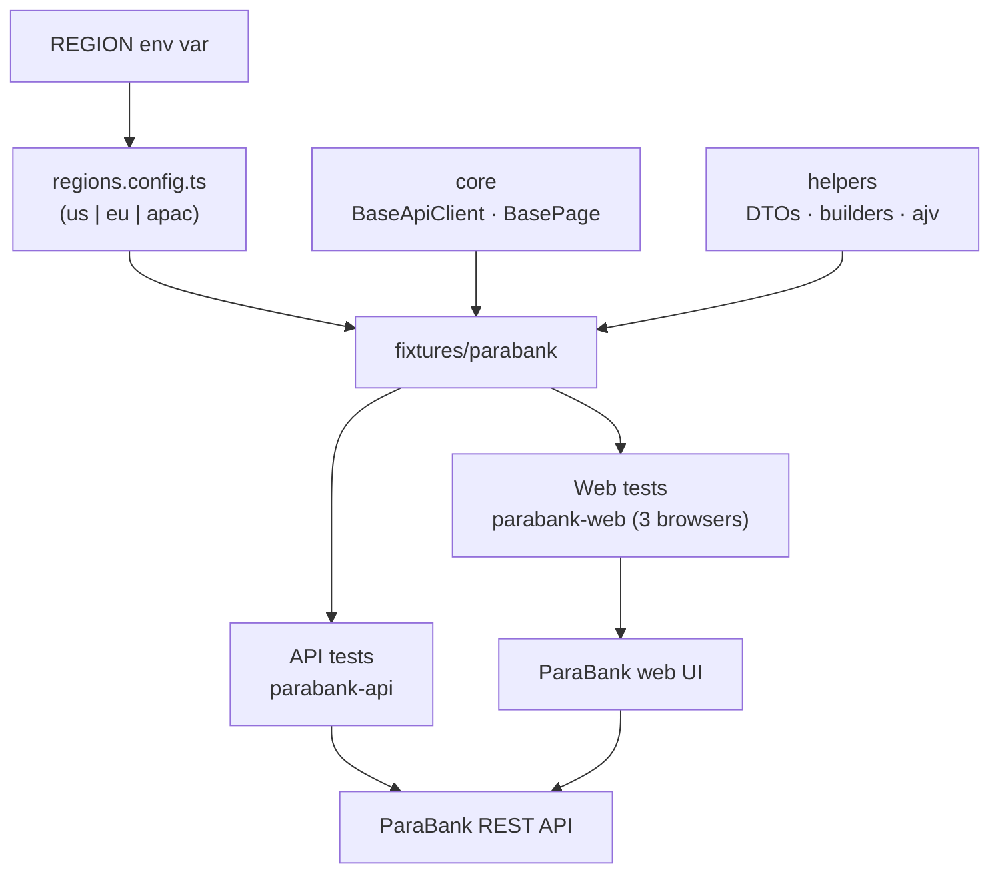

# Quipu QA Challenge — Multi-Region Playwright Framework

[](https://github.com/stalevski/quipu-task/actions/workflows/playwright.yml)
[](https://playwright.dev/)
[](https://www.typescriptlang.org/)
[](.nvmrc)

A **multi-region Playwright + TypeScript test framework** for a financial-services
context, built against **ParaBank** — Parasoft's demo banking application with a
web UI and a REST API. It demonstrates how independently deployable layers
(**API** and **Web**) share common infrastructure yet run on their own, and how
coverage follows a new **region** with zero test-code changes.

---

## Why ParaBank

ParaBank matches the challenge's financial domain: accounts, transfers, bill
pay, loans and transactions, exposed through both a customer-facing web app and
a REST API with a published OpenAPI spec. It also contains intentional defects
and resets its data periodically — which the challenge explicitly asks us to
document (`docs/parabank/bugs.md`). Because it is a shared public demo, the
suite treats it as an **informational target** in CI: flakiness is surfaced,
never hidden, and never blocks a merge.

ParaBank has no real regional deployments, so regions are **simulated through
configuration** (base URLs, locale, currency, time zone, credentials).

---

## Quickstart

Requires **Node 24** (see [`.nvmrc`](.nvmrc)).

```bash
npm install
npx playwright install          # browsers for the Web layer
```

Run everything (API + Web, default region `us`):

```bash
npm test
```

Run the layers **independently**:

```bash
npm run test:api                # API only (no browser needed)
npm run test:web                # Web only (Chromium + Firefox + WebKit)
```

---

## Running tests

| Goal                        | Command                                 |
| --------------------------- | --------------------------------------- |
| All layers, all projects    | `npm test`                              |
| API layer only              | `npm run test:api`                      |
| Web layer only (3 browsers) | `npm run test:web`                      |
| Region parity checks        | `npm run test:regions`                  |
| Smoke tags only             | `npm run test:smoke`                    |
| Open the HTML report        | `npm run report`                        |
| Lint / format               | `npm run lint` · `npm run format:check` |
| Typecheck + tool sanity     | `npm run doctor`                        |

---

## Docker

A [`Dockerfile`](Dockerfile) based on the Playwright image runs the whole suite
without a local Node/browser install:

```bash
docker build -t quipu-task .
docker run -e REGION=eu quipu-task          # override region at run time
```

---

## Region switching

The active region is selected by the `REGION` environment variable — never by
test code:

```bash
REGION=eu   npm run test:api     # run API tests for the EU region
REGION=apac npm run test:web     # run Web tests for the APAC region
```

Region configuration lives in `src/config/regions.config.ts`. Each region
carries its UI/API base URLs, locale, currency, time zone and credentials, all
overridable via environment variables (`.env.example`). The parity suite
(`tests/parabank/regions.spec.ts`) proves the abstraction holds.

### Adding a region in 5 minutes

One entry in `src/config/regions.config.ts` — no test changes:

```ts
// src/config/regions.config.ts
export const REGIONS: readonly Region[] = ['us', 'eu', 'apac', 'uk'];
export const regions: Record<Region, RegionConfig> = {
  // ...existing...
  uk: buildRegionConfig('uk', 'United Kingdom', 'en-GB', 'GBP', 'Europe/London'),
};
```

Now `REGION=uk npm test` runs the entire suite against that configuration.

---

## Architecture

Organised **system-first, then test-type**, so each layer is independently
runnable but shares infrastructure:

```text
src/
  config/regions.config.ts     region registry (the multi-region seam)
  core/                        BaseApiClient, BasePage, global setup
  helpers/
    api-clients/               typed ParaBank API client (extends BaseApiClient)
    schema-validator.ts        ajv wrapper for contract validation
    random-data-generator.ts   unique, collision-free test data
  models/api/parabank/         DTOs for transport
  builders/                    fluent test-data builders
  schemas/                     JSON Schemas derived from ParaBank's OpenAPI spec
  pages/parabank/              page objects (one per screen)
  fixtures/parabank/           Playwright fixtures (region, api client, pages)
tests/parabank/
  api/                         API specs (customers, accounts)
  web/                         Web specs (login, transfer)
  regions.spec.ts              region-configuration parity checks
playwright.config.ts           projects: parabank-web-* + parabank-api + parabank-regions
```



### Layer independence

- **`parabank-api`** runs with no browser (pure `APIRequestContext`), fast and
  fully parallel.
- **`parabank-web-*`** run in Chromium, Firefox and WebKit against the UI.
- Both layers import the same fixtures, builders and schema validator. A Web
  test can call the API client for setup or verification, and vice versa.

---

## Coverage

The challenge asked for specific coverage; the table maps each requirement to
its tests.

| Requirement                     | API                                             | Web                                                   |
| ------------------------------- | ----------------------------------------------- | ----------------------------------------------------- |
| Happy path                      | `customers.api.spec.ts`, `accounts.api.spec.ts` | `login.web.spec.ts`, `transfer.web.spec.ts`           |
| Error state                     | bad login `400`, unknown id `400`               | empty transfer amount → error page                    |
| Idempotency / edge case         | repeated login returns the same id              | logout/login session round-trip                       |
| Web test using an API operation | —                                               | `transfer.web.spec.ts` (API setup + API verification) |
| Schema validation               | customer / account / transaction via `ajv`      | —                                                     |

### Schema validation & contract testing

JSON Schemas in `src/schemas/` are **derived from ParaBank's published OpenAPI
spec** (`/api-docs`) and validated with `ajv`. Where the spec and reality drift
(e.g. `Transaction.date` is declared `string (date-time)` but returned as epoch
milliseconds), the drift is documented in `docs/parabank/bugs.md` and pinned by
a `@known-defect` test.

---

## Known defects

ParaBank ships with intentional defects and quirks that affect testing. They are
catalogued in [`docs/parabank/bugs.md`](docs/parabank/bugs.md) and pinned by
tests tagged `@known-defect`, which assert the _current_ (buggy) behaviour so a
vendor fix shows up as a failing test rather than silent drift.

---

## CI

`.github/workflows/playwright.yml` runs **lint**, then the **API** and **Web**
jobs, each matrixed across `us` / `eu` / `apac` and each independently runnable
via the `workflow_dispatch` `layer` input. `@known-defect` pins run in a separate
informational job so a vendor fix surfaces there without polluting the main
signal, and every HTML report is uploaded as an artifact and published to
**GitHub Pages**. The public demo's flakiness is handled with
`continue-on-error`, so external instability never blocks a merge.

---

## Mobile (Part 2)

A design document — [`docs/mobile-design.md`](docs/mobile-design.md) — describes
how Android/iOS tests (Appium) would plug into the same region configuration,
test-data builders and reporting without forking the framework.

---

## AI-assisted workflow

This project was built **AI-assisted, human-directed** — the architecture,
contract research against the live API, and the final review decisions are
human-owned; the mechanical scaffolding and test authoring were accelerated with
AI tooling.
